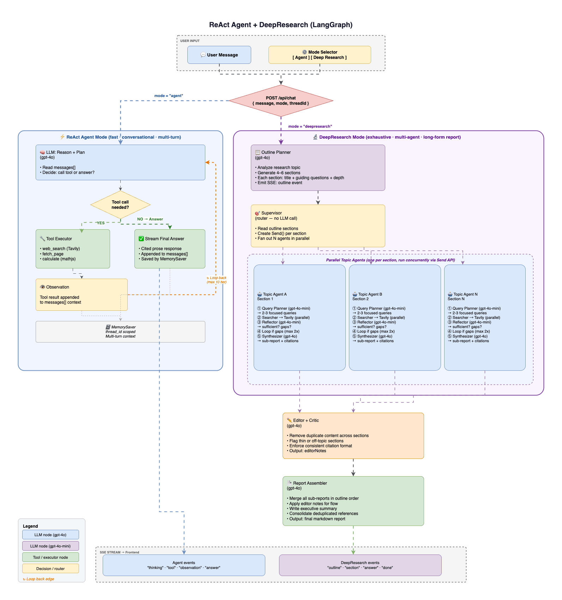

# 🦜️🔗 Deep Research & Unified Agent Workspace

A state-of-the-art AI research and writing environment built with **Next.js**, **LangGraph**, **LangChain**, and **OpenAI**. This workspace integrates high-speed agentic reasoning with comprehensive deep research and a live-streaming co-writing canvas.

## Architecture

## 🚀 System Logic & Architecture

The application is structured around two primary interaction modes, both managed through a unified interface and a streamlined API.

### 1. 🤖 ReAct Agent (Agent Mode)
The "Agent" mode uses a **ReAct (Reason + Act)** loop powered by `createReactAgent`.
- **Tool Orchestration**: The agent has access to `search_web` for real-time information and a suite of **Canvas Tools**.
- **Automated Canvas Logic**: The agent follows strict system instructions to route any substantial text generation (blogs, reports, code) to the Canvas side-panel rather than cluttering the chat.
- **Context Awareness**: When users trigger "Quick Actions," the system automatically injects the current Canvas state (title, type, and selected text) into the prompt, allowing the agent to perform targeted edits via the `canvas_update` tool.

### 2. 🔍 Deep Research Mode
A multi-agent orchestrated workflow designed for deep-dive reporting.
- **Workflow Phases**:
    1.  **Planning**: Generates an optimized research outline based on the user topic.
    2.  **Research**: Sparks parallel search tasks for each section, gathering data from the web.
    3.  **Assembly**: Synthesizes the gathered data into a cohesive, multi-section report with inline citations.
- **Structured Output**: Uses Zod-validated schemas to ensure research data is consistently formatted and verifiable.

### 3. ✦ Integrated Canvas (The Side-Panel)
The Canvas is a persistent, tool-driven side-panel that replaces traditional standalone document modes.
- **Live Streaming Content**: We implemented a customized SSE (Server-Sent Events) handler that intercepts partial JSON tokens from tool call arguments. This allows the Canvas to **stream text live** as the agent generates it, rather than waiting for the entire tool call to finish.
- **Dual Rendering**:
    - **Markdown**: Renders clean, readable previews (source view is disabled for a focused reading experience).
    - **Code**: Integrated with **Monaco Editor** for full syntax highlighting and line navigation.
- **Version Control**: Every time the agent updates the Canvas, a new version is created. Users can navigate history using the integrated version toolbar.
- **Interactive Refinement**: The side-panel features a toolbar with quick-actions (Fix Grammar, Rewrite, etc.) that interact directly with the ReAct agent to refine the document in place.

---

## 🏗️ Technical Implementation Details

### API Streaming Strategy
The `/api/research` route handles the complexity of merging tool calls, token streaming, and artifact synchronization.
1.  **Token Interception**: We use `streamMode: "messages"` in LangGraph to get raw chunks.
2.  **Partial JSON Extraction**: A specialized helper (`extractCanvasContent`) pulls out data from the `content` argument of `canvas_write` or `canvas_update` while it's still being streamed.
3.  **SSE Events**: The server emits `artifact_chunk` events the moment a tool call starts, ensuring the UI opens and begins rendering immediately.

### State Management
- **Persistence**: Chat history and artifact versions are persisted to `localStorage`, allowing for session recovery.
- **Synchronized UI**: The `DeepResearchChat` component acts as the central hub, managing the visibility of the Canvas panel based on real-time SSE triggers (`canvas_open`).

---

## 🛠️ Getting Started

1. **Install Dependencies**: `yarn install`
2. **Setup Keys**: Copy `.env.example` to `.env` and add your `OPENAI_API_KEY` and `TAVILY_API_KEY`.
3. **Run Dev Server**: `yarn dev`
4. **Access UI**: Navigate to `http://localhost:3000`.
